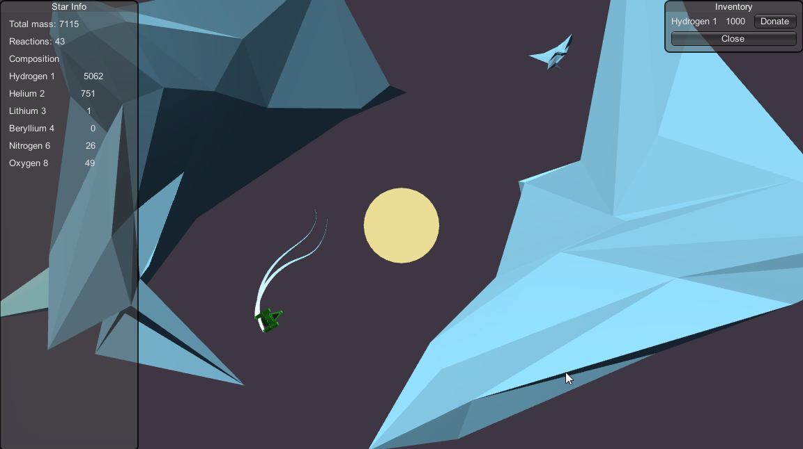

# KeepItAlive
LD 46 Keep it Alive.

Unfortunately life got in the way this weekend and i’ve been a little depressed so stopped working on my entry however I’ll post the Source for you to enjoy.

My game involves feeding elements to a star which in turn fuses them together into heavier elements which you can use for your ship. The star will explode/implode if the balance of mass and fusion events is not maintained. The goal would have been to have a symbiotic relationship with the star where you keep it alive and it produces valuable elements to keep your ship running, so that you can continue to provide for it.

The only working component is the Star, the other half would have been exploration and combat.

Please do take a look at the source and fork it, feel free to use it in your games. (invitation extends to the last commit made when the compo ends) (Covering my ass i guess).

